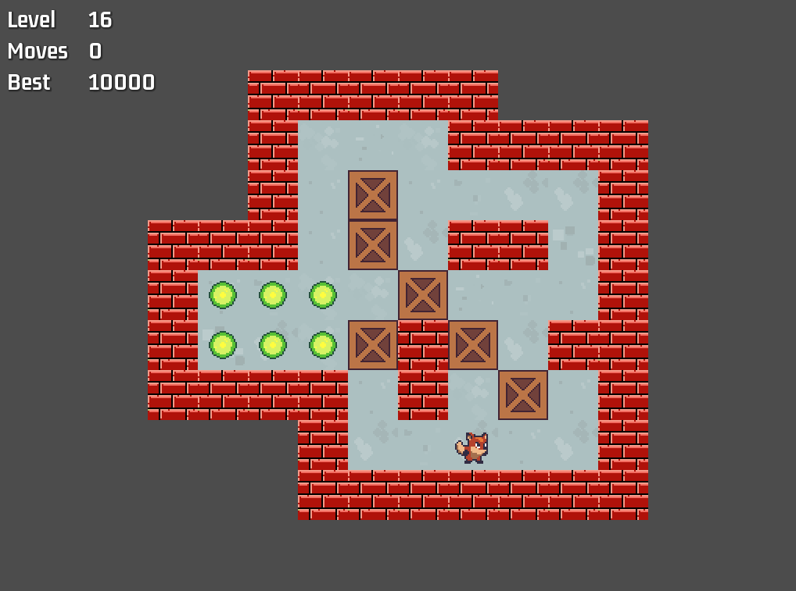

# godot-studies

Repository for some Godot courses that I took at Udemy: 
- [Jumpstart to 2D Game Development: Godot 4 for Beginners](https://www.udemy.com/course/jumpstart-to-2d-game-development-godot-4-for-beginners/).
- [Godot 4 Shaders: Craft Stunning Visuals](https://www.udemy.com/course/godot-4-shaders/)

Here is a list of the developed games and the main things that were learned.

## Tappy Plane

- Flappy Bird clone
- Basics of game development in a engine
- Singletons and Signals patterns
- Parallax backgrounds
- Randomly generated objects in a spawner

## Angry Animals

- Angry Birds-ish clone
- Vector calculations
- Animations
- Physics

## Memory Madness

- Memory game
- Dynamic Asset loading

## Foxy Antics

- Inherited Scenes
- Dynamic Scene instantiation
- Tile Sets and Tilemaps
- Animation states

## Sokoban

- Sokoban clone
- Basic grid-like movement

## Space Ace

- SHMUP game
- Powerups
- Enemy wave management
- Particles

## Do Not Mind Me

- Top-down game
- Tilemap layers
- NPC pathfinding and navigation

